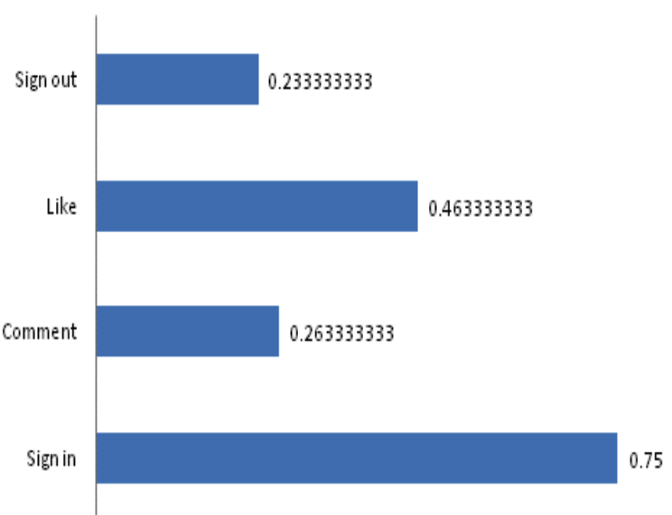

## Overview
The aim of this paper is to evaluate empirically Instagram Interface by elderly Arab.The finding of the study highlighted a set of computer usability challenges that need to be taken into account by designers and developers in order to improve the usability of the Instagram Desktop Interface for elderly Arab.

## Unique Theme
Social networks are on a continuous developing and have turn out to be generally
utilized all through the around the world. As apps make our lives more convenient, the impact on different groups does vary. This article focuses on a small group of elderly Arab users to evaluate the user friendliness of apps, which makes the topic of the article very unique.
## Scientific Methodology
In the form of questionnaire survey, this paper evaluates the four interfaces of Instagram: Sign in, Comment, LIke, and Sign out. The users were divided into four ages and the time taken to complete each interface was recorded, and then the average score was calculated. The results are shown in the figure below.

## Comprehensive Conclusion
Through scientific methodology and unique theme, this paper gives four very meaningful suggestions based on the software Instagram.
- Provide a small description (use hint) of how to use the icons efficiently or help center. 
- The like button must be defined for example write (like) keyword below the button.
- Enable users to change icons and font size as most elderly face vision
impairment.
- Enable user to choose interface preference from layout and color as
some users consider bright colors annoying. 

## Reference
Jarraf, Z., Banan Farhoud, A. A., Sayah, A., & Yadav, K. Usability Evaluation of Instagram for Elderly Arab Users.
