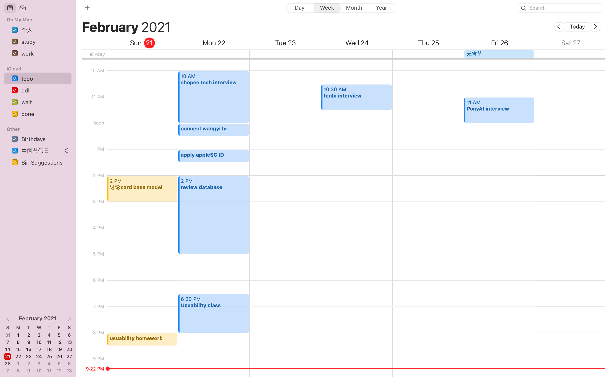
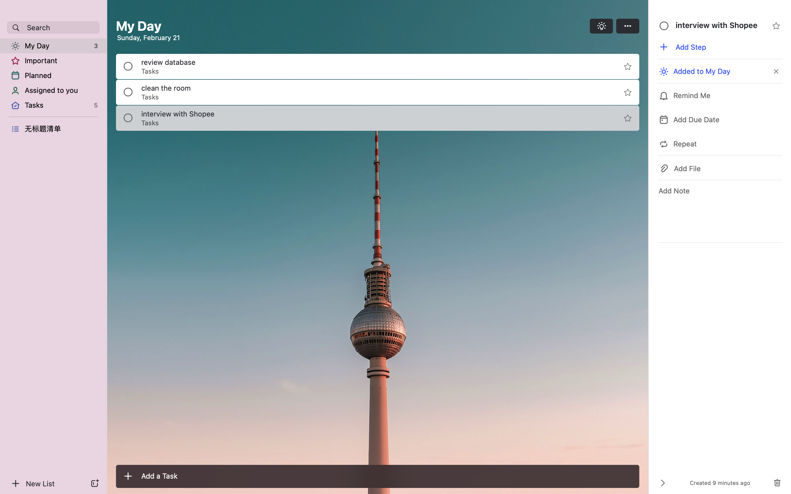

## Introduction
Keeping TODO lists in software is one of the big changes the Internet has brought to workers. 
There are a lot of applications for keeping lists of Todos in the market. 
Here's what I'd like to compare: **Apple's Calendar app** and **Microsoft's Todo**, 
which focuses on the user interaction. Here is the homepage of the two applications.

## Apple's Calendar VS Microsoft's Todo

### What is user's goal?
- Record TODO  item quickly
- Review what have done in a timely manner
- Be clear about the priorities

### Record TODO  item quickly
In the apple calendar, you can start recording the TODO content anywhere, drag and drop the module to place the TODO project at the point you want to start, and adjust the time interval for completion by changing the length of the module.In Microsoft'Todo you can only record Todo items from the bottom of the screen, and you can only add due date, so you can't see the order of things in the Todo list at a glance.

### Review what have done in a timely manner
In the apple calendar, user can choose to view the previous TODO list in four dimensions: day, week, month and year. This function is convenient for us to review ourselves and the degree of completion of TODO and help us to make some adjustments when recording TODO in the future.But in Microsoft Todo, you can only view the current day's Todo, which makes it difficult to review what you've already done.
### Be clear about the priorities
 In the Apple Calendar, you can set the priority of different items in the left sidebar, which is separated by color. In Microsoft TODO, all TODO are placed at the same level, which is not good for us to manage our time.

## Conclusion

Apple Calendar clearly takes precedence over Microsoft Todo in terms of usability and user friendliness. Microsoft Todo is less useful but it can be integrated with Microsoft Outlook to automatically migrate Todo, which is one of the ways it appeals to users.
